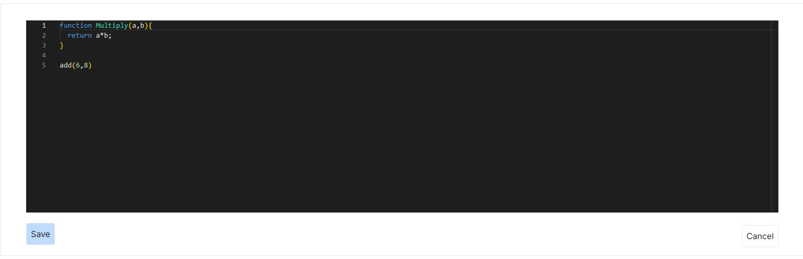

# Code Snippet Vorstellungstool

Ein leistungsfähiges Tool zum Schreiben, Darstellen.

## Funktionen

- Unterstützung für mehrere Programmiersprachen
- Syntax-Highlighting
- Live-Vorschau
- Responsive Design für mobile und Desktop-Nutzung
- 
## Installation

1. bash
2. git clone 
3. npm install install
4.  npm run dev 

## Dependencies

- prisma,
- prisma-client
- monaco

